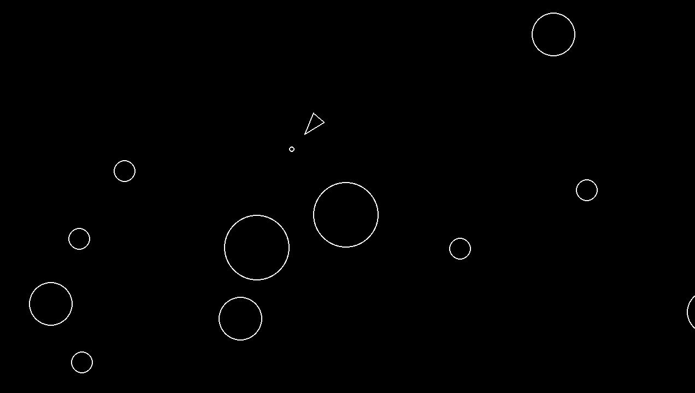

# Asteroids

A recreation of the classic Asteroids game in Pythom with Pygame.

Asteroids was a guided project from [Boot.dev](https://www.boot.dev).

## Environment

Requires Python 3.10+. 

Virtual environment created with [uv](https://github.com/astral-sh/uv).

## Usage

Inside the Asteroids directory, activate the virtual environment:

```console
source .venv/bin/activate
```

Then run the main Python file to start the game:

```console
uv run main.py
```

## How to play

Press <kbd>w</kbd> to move forward.
Press <kbd>s</kbd> to move backward.

Press <kbd>a</kbd> to rotate left.
Press <kbd>d</kbd> to rotate right.

Press <kbd>space</kbd> to shoot.

Shoot the asteroids to avoid being killed. Bigger asteroids will break apart into smaller ones so be careful!


